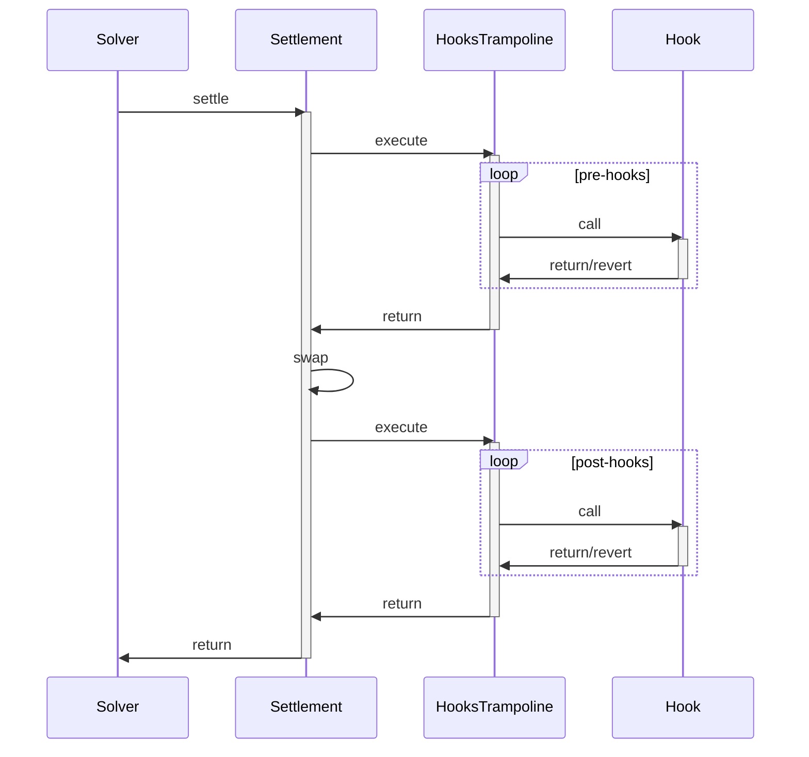

## Overview

Hooks are custom Ethereum calls that execute atomically within a CoW Protocol settlement transaction. The Hooks Trampoline orchestrates hook execution at specific points in the settlement lifecycle while maintaining security and reliability.

## Settlement Lifecycle

A complete settlement with hooks follows this sequence:



## Pre-Hooks vs Post-Hooks

Hooks can execute at two distinct points in the settlement:

### Pre-Hooks

Execute **before** the trade is settled.

**Use cases:**
- Approving tokens for the settlement
- Setting up contracts or permissions needed for the trade
- Depositing tokens into protocols
- Unwrapping tokens (e.g., WETH → ETH)
- Validating pre-conditions

**Example: Token Approval**

```solidity
contract ApprovalHook {
    function approveForTrade(
        address token,
        address spender,
        uint256 amount
    ) external {
        require(
            msg.sender == HOOKS_TRAMPOLINE,
            "only from settlement"
        );
        
        IERC20(token).approve(spender, amount);
    }
}
```

### Post-Hooks

Execute **after** the trade is settled.

**Use cases:**
- Staking received tokens
- Depositing into yield protocols
- Wrapping tokens (e.g., ETH → WETH)
- Triggering follow-up actions
- Recording trade metadata

**Example: Auto-Stake**

```solidity
contract StakingHook {
    IStakingContract public stakingContract;
    
    function stakeReceivedTokens(
        address token,
        uint256 amount
    ) external {
        require(
            msg.sender == HOOKS_TRAMPOLINE,
            "only from settlement"
        );
        
        // Approve staking contract
        IERC20(token).approve(address(stakingContract), amount);
        
        // Stake the tokens
        stakingContract.stake(token, amount);
    }
}
```

<Info>
Hooks execute atomically with the settlement. If the settlement reverts, all hook effects are also reverted. However, if a hook reverts, the settlement can still succeed.
</Info>

## Hook Structure

Each hook is defined by three parameters:

```solidity
struct Hook {
    address target;      // Contract to call
    bytes callData;      // Encoded function call
    uint256 gasLimit;    // Maximum gas for this hook
}
```

From `HooksTrampoline.sol:11-15`.

### Building a Hook

```solidity
// Define the hook
HooksTrampoline.Hook memory myHook = HooksTrampoline.Hook({
    target: address(myHookContract),
    callData: abi.encodeCall(
        MyHookContract.doSomething,
        (param1, param2)
    ),
    gasLimit: 100_000
});

// Create array of hooks
HooksTrampoline.Hook[] memory hooks = new HooksTrampoline.Hook[](1);
hooks[0] = myHook;

// Execute (only callable by settlement contract)
trampoline.execute(hooks);
```

## How Hooks Execute

The trampoline processes hooks sequentially:

```solidity
function execute(Hook[] calldata hooks) external onlySettlement {
    unchecked {
        Hook calldata hook;
        for (uint256 i; i < hooks.length; ++i) {
            hook = hooks[i];
            
            // Check if enough gas is available
            uint256 forwardedGas = gasleft() * 63 / 64;
            if (forwardedGas < hook.gasLimit) {
                revertByWastingGas();
            }

            // Execute the hook with specified gas limit
            (bool success,) = hook.target.call{gas: hook.gasLimit}(hook.callData);

            // Explicitly allow hooks to revert without affecting settlement
            success;
        }
    }
}
```

From `HooksTrampoline.sol:55-77`.

### Key Execution Properties

1. **Sequential Processing**: Hooks execute in array order (index 0, then 1, then 2, etc.)
2. **Gas-Limited**: Each hook receives at most its specified gas limit
3. **Revert-Tolerant**: Hook reverts don't cause settlement failure
4. **Access-Controlled**: Only the settlement contract can trigger execution

## Sequential Hook Execution

Hooks execute in the exact order they appear in the array, which enables powerful composition patterns.

### Example: Multi-Step Setup

From `HooksTrampoline.t.sol:79-95`:

```solidity
function test_ExecutesHooksInOrder() public {
    CallInOrder order = new CallInOrder();

    HooksTrampoline.Hook[] memory hooks = new HooksTrampoline.Hook[](10);
    for (uint256 i = 0; i < hooks.length; i++) {
        hooks[i] = HooksTrampoline.Hook({
            target: address(order),
            callData: abi.encodeCall(CallInOrder.called, (i)),
            gasLimit: 25000
        });
    }

    vm.prank(settlement);
    trampoline.execute(hooks);

    assertEq(order.count(), hooks.length);
}
```

This test demonstrates that hooks execute in sequence, allowing patterns like:

```solidity
// Step 1: Unwrap WETH
hooks[0] = Hook({target: weth, callData: withdraw(amount), gasLimit: 50000});

// Step 2: Use ETH to buy NFT
hooks[1] = Hook({target: nftMarket, callData: buyNFT{value: amount}(tokenId), gasLimit: 100000});

// Step 3: Transfer NFT to user
hooks[2] = Hook({target: nft, callData: transferFrom(this, user, tokenId), gasLimit: 50000});
```

## Revert Handling

One of the trampoline's key features is that individual hook failures don't break settlements.

### How Reverts Are Handled

From `HooksTrampoline.sol:70-74`:

```solidity
(bool success,) = hook.target.call{gas: hook.gasLimit}(hook.callData);

// In order to prevent custom hooks from DoS-ing settlements, we
// explicitly allow them to revert.
success;
```

The `success` variable is read but not checked, allowing the function to continue even if the hook reverted.

### Example: Resilient Hook Chain

From `HooksTrampoline.t.sol:52-77`:

```solidity
function test_AllowsReverts() public {
    Counter counter = new Counter();
    Reverter reverter = new Reverter();

    HooksTrampoline.Hook[] memory hooks = new HooksTrampoline.Hook[](3);
    
    // Hook 1: Succeeds
    hooks[0] = HooksTrampoline.Hook({
        target: address(counter),
        callData: abi.encodeCall(Counter.increment, ()),
        gasLimit: 50000
    });
    
    // Hook 2: Reverts
    hooks[1] = HooksTrampoline.Hook({
        target: address(reverter),
        callData: abi.encodeCall(Reverter.doRevert, ("boom")),
        gasLimit: 50000
    });
    
    // Hook 3: Succeeds
    hooks[2] = HooksTrampoline.Hook({
        target: address(counter),
        callData: abi.encodeCall(Counter.increment, ()),
        gasLimit: 50000
    });

    vm.prank(settlement);
    trampoline.execute(hooks);

    // Counter was incremented twice (hooks 0 and 2)
    assertEq(counter.value(), 2);
}
```

This demonstrates:
- Hook 0 executes successfully
- Hook 1 reverts (but doesn't stop execution)
- Hook 2 executes successfully
- The settlement completes with 2 out of 3 hooks successful

<Warning>
While hooks can revert without breaking settlements, **all hook effects are still atomic with the settlement**. If the overall settlement transaction reverts, all hook effects are also reverted.
</Warning>

## Structuring Hook Contracts

### Basic Hook Contract Pattern

```solidity
contract MyHook {
    address public immutable trampoline;
    
    constructor(address _trampoline) {
        trampoline = _trampoline;
    }
    
    modifier onlyFromSettlement() {
        require(
            msg.sender == trampoline,
            "only from settlement"
        );
        _;
    }
    
    function myHookFunction(
        address token,
        uint256 amount
    ) external onlyFromSettlement {
        // Hook implementation
        _performAction(token, amount);
    }
    
    function _performAction(
        address token,
        uint256 amount
    ) internal {
        // Implementation details
    }
}
```

### Multi-Function Hook Contract

```solidity
contract MultiHook {
    address public immutable trampoline;
    
    constructor(address _trampoline) {
        trampoline = _trampoline;
    }
    
    modifier onlyFromSettlement() {
        require(msg.sender == trampoline, "only from settlement");
        _;
    }
    
    // Pre-hook: Setup
    function setup(
        address token,
        uint256 amount
    ) external onlyFromSettlement {
        IERC20(token).approve(TARGET, amount);
    }
    
    // Post-hook: Cleanup
    function cleanup(
        address token
    ) external onlyFromSettlement {
        uint256 balance = IERC20(token).balanceOf(address(this));
        if (balance > 0) {
            IERC20(token).transfer(msg.sender, balance);
        }
    }
}
```

### Stateful Hook Contract

```solidity
contract StatefulHook {
    address public immutable trampoline;
    
    mapping(address => uint256) public userActivity;
    
    constructor(address _trampoline) {
        trampoline = _trampoline;
    }
    
    function recordTrade(
        address user,
        address tokenIn,
        address tokenOut,
        uint256 amountIn,
        uint256 amountOut
    ) external {
        require(msg.sender == trampoline, "only from settlement");
        
        // Record trade data
        userActivity[user]++;
        
        // Emit event for off-chain tracking
        emit TradeRecorded(
            user,
            tokenIn,
            tokenOut,
            amountIn,
            amountOut,
            block.timestamp
        );
    }
    
    event TradeRecorded(
        address indexed user,
        address indexed tokenIn,
        address indexed tokenOut,
        uint256 amountIn,
        uint256 amountOut,
        uint256 timestamp
    );
}
```

## Example Settlement Workflow

Here's a complete example of a settlement with pre and post-hooks:

### Scenario: Swap ETH for DAI and Stake

**Setup:**
- User has WETH and wants DAI
- After receiving DAI, automatically stake it in a yield protocol

**Step 1: Create Unwrap Hook (Pre-Hook)**

```solidity
// Unwrap WETH to ETH before the trade
HooksTrampoline.Hook memory preHook = HooksTrampoline.Hook({
    target: address(weth),
    callData: abi.encodeCall(
        IWETH.withdraw,
        (wethAmount)
    ),
    gasLimit: 50_000
});
```

**Step 2: Settlement Executes**

The CoW Protocol settlement swaps the user's tokens:
- Sells WETH
- Buys DAI
- Transfers DAI to user's address

**Step 3: Create Staking Hook (Post-Hook)**

```solidity
// Stake received DAI
HooksTrampoline.Hook memory postHook = HooksTrampoline.Hook({
    target: address(stakingHook),
    callData: abi.encodeCall(
        StakingHook.stakeDAI,
        (daiAmount)
    ),
    gasLimit: 150_000
});
```

**Step 4: Execute Complete Settlement**

```solidity
// Combine hooks
HooksTrampoline.Hook[] memory allHooks = new HooksTrampoline.Hook[](2);
allHooks[0] = preHook;   // Execute before swap
allHooks[1] = postHook;  // Execute after swap

// Settlement contract calls trampoline
trampoline.execute(allHooks);
```

### Transaction Flow

1. Solver calls `Settlement.settle()`
2. Settlement calls `HooksTrampoline.execute(preHooks)`
   - Unwrap WETH → ETH
3. Settlement executes the swap
   - ETH → DAI trade
4. Settlement calls `HooksTrampoline.execute(postHooks)`
   - Stake DAI in yield protocol
5. Settlement returns to solver

<Info>
All steps execute atomically. If any part fails, the entire transaction reverts (unless it's a hook revert, which is allowed).
</Info>

## Why Settlements Don't Revert on Hook Failures

From `README.md:13-19`:

> Reverting unnecessary hooks during a settlement can cause two issues:
> - `Interaction`s from the settlement contract are called with all remaining `gasleft()`. This means, that a revert from an `INVALID` opcode for example, would consume 63/64ths of the total transaction gas. This means that hooks can make settlements extremely expensive for nothing.
> - Other orders being executed as part of the settlement would also not be included.

By allowing hooks to revert without affecting the settlement:

1. **Prevents DoS**: A single user's broken hook can't block other users' trades
2. **Gas Protection**: Hook reverts don't consume all transaction gas
3. **Settlement Reliability**: Solvers can confidently include orders with hooks

### Example: Multi-Order Settlement Protection

Consider a settlement with 3 orders:
- Order A: No hooks
- Order B: Has a buggy hook that reverts
- Order C: No hooks

With the trampoline's revert handling:
- Order A settles successfully ✓
- Order B settles successfully (hook reverts but order succeeds) ✓
- Order C settles successfully ✓

Without revert handling:
- Entire settlement would revert ✗
- All 3 orders fail ✗
- Gas is wasted ✗

## Integration Checklist

When building hooks for CoW Protocol settlements:

- [ ] **Access Control**: Verify `msg.sender == trampoline` in your hook functions
- [ ] **Gas Limits**: Set conservative gas limits for each hook (test actual usage + 20% buffer)
- [ ] **Revert Handling**: Design hooks to fail gracefully if they can't complete
- [ ] **Sequential Logic**: Order your hooks array correctly if there are dependencies
- [ ] **Pre vs Post**: Choose the right execution timing for each hook's purpose
- [ ] **Atomicity**: Remember that all hooks are atomic with the settlement
- [ ] **Testing**: Test both successful execution and revert scenarios

## Best Practices

### 1. Conservative Gas Limits

```solidity
// Bad: Exact gas usage
Hook({target: myContract, callData: data, gasLimit: 50_000});

// Good: Gas usage + safety buffer
Hook({target: myContract, callData: data, gasLimit: 60_000});
```

### 2. Idempotent Hooks

Design hooks that can be safely retried:

```solidity
function safeApprove(address token, address spender, uint256 amount) external {
    require(msg.sender == trampoline, "only from settlement");
    
    // Check current allowance
    uint256 currentAllowance = IERC20(token).allowance(address(this), spender);
    
    // Only approve if needed
    if (currentAllowance < amount) {
        IERC20(token).approve(spender, amount);
    }
}
```

### 3. Clear Error Messages

```solidity
function myHook() external {
    require(msg.sender == trampoline, "MyHook: only from settlement");
    require(condition, "MyHook: invalid condition");
    // Clear errors help with debugging
}
```

### 4. Event Logging

```solidity
event HookExecuted(
    address indexed user,
    bytes32 indexed orderUid,
    bool success
);

function myHook(address user, bytes32 orderUid) external {
    require(msg.sender == trampoline, "only from settlement");
    
    bool success = _attemptAction();
    
    emit HookExecuted(user, orderUid, success);
}
```

## Limitations and Considerations

### Gas Limit Precision

Hooks may receive slightly less gas than specified due to:
- EVM's 63/64 forwarding rule
- Operations between gas reading and hook execution
- Always add a safety buffer (10-20%) to your gas limits

### No Return Values

Hook return values are not captured:

```solidity
(bool success,) = hook.target.call{gas: hook.gasLimit}(hook.callData);
```

If you need to communicate results:
- Use events
- Write to contract storage
- Use off-chain monitoring

### Execution Context

Hooks execute from the trampoline's address:
- `msg.sender` in the hook = trampoline address
- Not the settlement contract address
- Not the user's address

<Note>
Design your hook contracts with the understanding that they operate in a constrained environment: limited gas, no return value capture, and specific execution context.
</Note>

## Summary

| Concept | Key Points |
|---------|----------|
| **Pre-Hooks** | Execute before the swap; used for setup, approvals, unwrapping |
| **Post-Hooks** | Execute after the swap; used for staking, wrapping, cleanup |
| **Sequential Execution** | Hooks run in array order, enabling multi-step workflows |
| **Revert Tolerance** | Individual hook failures don't break the settlement |
| **Atomicity** | All hooks and settlement are atomic; total transaction revert affects everything |
| **Access Control** | Only settlement can trigger hooks; hooks verify `msg.sender == trampoline` |
| **Gas Management** | Each hook has an enforced gas limit to prevent abuse |

## Additional Reading

- [Security Model](/architecture/security) - Understanding isolation and access control
- [Gas Management](/architecture/gas-management) - Deep dive into gas limit enforcement